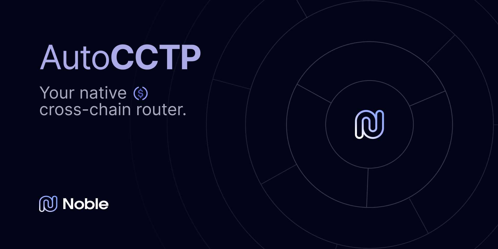
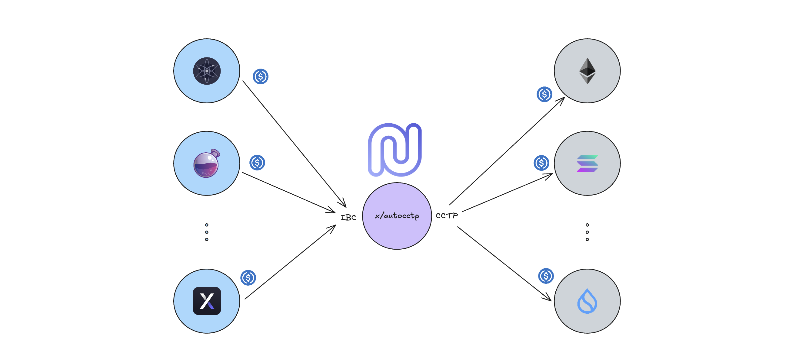

<div align="center">
  <a href="https://github.com/noble-assets/autocctp/releases/latest">
    
  </a>
  <a href="https://github.com/noble-assets/autocctp/blob/main/LICENSE">
    
  </a>
  <a href="https://github.com/noble-assets/autocctp/actions/workflows/e2e-tests.yaml">
    
  </a>
</div>
<br>



The `x/autocctp` module is designed to facilitate the transfer of
[CCTP](https://docs.noble.xyz/cctp) supported tokens from any IBC enabled chain
connected to Noble, to another CCTP-supported chain. Currently, the only token
supported for the transfer via CCTP is $USDC.



At its core, this module implements a custom account type that extends the base
account with transfer-specific information. The custom account acts as a router
for CCTP transfers. When a user sends funds to a registered AutoCCTP account,
the custom `x/bank` module's `SendRestrictionFn` adds the recipient address to
an in-memory map of pending transfers. These transfers are then executed via the
`x/cctp` module during the chain's `EndBlock` operation. For more info about the
custom account, please refer to the [AutoCCTP Account](#autocctp-account)
section.

From a user's perspective, there are two steps required to start using AutoCCTP
functionalities. In `Step 1`, a custom AutoCCTP account is created with specific
information about the designated recipient of all incoming funds. In `Step 2`,
the user transfers funds via IBC to the newly created AutoCCTP account, and
these funds are automatically forwarded to the recipient through the chain using
the `x/autocctp` module.


## Installation

```sh
git clone https://github.com/noble-assets/autocctp.git
cd autocctp
git checkout <TAG>
make build
```

## AutoCCTP Account

The AutoCCTP module defines a custom `Account` type which wraps the
`BaseAccount` to store information required by the CCTP protocol. Specifically,
the custom account adds the following information:

- `DestinationDomain`: the
  [CCTP identifier](https://developers.circle.com/stablecoins/supported-domains)
  of the destination chain.

- `MintRecipient`: the address of the receiver on the destination domain.

- `FallbackRecipient`: Noble address which can be used as a fallback receiver of
  the funds.

- `DestinationCaller`: the address on the destination chain allowed to complete
  the CCTP transfer.

All the fields are required and cannot be empty, except for the destination
caller. Each AutoCCTP account is associated with an address derived from the
value of its fields.

## State

The module's state consists of the following Cosmos SDK collections:

- **Number of Accounts**: the AutoCCTP module maintains a count of all the
  custom accounts created. This information is stored for every destination
  domain via the `NumOfAccounts` type.

- **Number of Transfers**: used to keep track of the number of AutoCCTP
  transfers executed for every destination domain.

- **Total Transferred**: the module records the cumulative $USDC amount
  transferred to each supported destination chain. This information is stored in
  the `TotalTransferred` collection.

- **Pending Transfers**: is a temporary data structure that collects all $USDC
  transfer requests initiated during the current block's execution. This
  collection specifically tracks transfers associated with custom accounts that
  are pending processing.

## State Transitions

### Account Registration

A custom AutoCCTP account can be registered on the chain in two ways:

1. `types.MsgRegisterAccount`

2. `types.MsgRegisterAccountSignerlessly`

The difference between the two methods is that the second one does not require a
registered account to sign the transaction, but requires that the future
AutoCCTP account has enough balance to pay for gas fees. This feature enables
users without a Noble account to leverage this module's functionality, but at
the same time, protect the chain from possible spam attacks.

### Account Clearing

When an AutoCCTP account is registered, or receives funds, it is inserted into
an in-memory list of accounts whose balance will be sent via CCTP to the
associated receiver at the end of the block. If a transfer fails, users must
call the `types.MsgClearAccount` to retry the transfer in a future block. This
message allows to specify if the funds have to be transferred via CCTP to the
receiver account, or to a fallback Noble account.

An automatic transfer via this module could fail for different reasons, one for
example, is when one of the dependencies of this module, like the fiat token
factory, is paused.

## Queries

### Statistics

The module collects statistics of the `x/autocctp` transfer usage, which can be
retrieved via the `types.QueryStats` request. For every destination domain, the
following information is returned:

- The number of accounts created.

- The total number of transfers.

- The total amount transferred.

It is also possible to query information for a specific destination domain via
`types.QueryStatsByDestinationDomain`.

### Accounts

It is possible to check if an account already exists or not on the chain via
`types.QueryAddress`. The query requires the destination domain, the mint
recipient, the fallback recipient, and if associated with the account, the
destination caller.

## Dependencies

The AutoCCTP module relies on the following Cosmos SDK modules to allow a
seamless transfer of $USDC:

- `x/auth`: required to operate on accounts and create the custom one.

- `x/bank`: required to get the balance of the custom account and add receiving
  accounts to the list of pending transfers.

- `x/fiat-tokenfactory`: required to handle $USDC on Noble.

- `x/cctp`: required to initiate transfers via CCTP and to query module
  parameters.

## Tests

Tests for the module can be run using the `Makefile`. To run unit tests:

```sh
make test-unit
```

End-to-end tests are based on
[interchaintest](https://github.com/strangelove-ventures/interchaintest) to
verify full system functionality. They require Docker running and a local image
of the simulation application:

```sh
make local-image
make test-e2e
```

If you want to run a specific test case:

```sh
go test -v ./e2e/... -run <TEST_NAME>
```

## Examples

Below examples use a simulation app binary. To run the examples locally, please
follow the steps described in the [Installation](#installation) section, and
start the local node:

```sh
chmod +x ./local.sh
./local.sh
```

To get statistics for the destination domain `0`:

```sh
./simapp/build/simd q autocctp stats 0
```

To check if an AutoCCTP account for the destination domain `0`, the mint
recipient `0xaB537dC791355d986A4f7a9a53f3D8810fd870D1`, and a fallback account
`noble1h8tqx833l3t2s45mwxjz29r85dcevy93wk63za` is registered:

```sh
./simapp/build/simd q autocctp address 0 0xab537dc791355d986a4f7a9a53f3d8810fd870d1 noble1h8tqx833l3t2s45mwxjz29r85dcevy93wk63za
```

To register a new AutoCCTP account for the same information of the previous
example:

```sh
./simapp/build/simd tx autocctp register-account 0 0xaB537dC791355d986A4f7a9a53f3D8810fd870D1 noble1h8tqx833l3t2s45mwxjz29r85dcevy93wk63za --from validator --home .autocctp --chain-id autocctp-1 --keyring-backend test
```

To register the account signerlessly, the future AutoCCTP account has to be
registered in the store and should have at least the minimum amount of $USDC
required from the protocol.

```sh
./simapp/build/simd tx bank send validator noble1du3zaju8jjne4qa8m2n0tgg707khcvrm5h2stg 100000uusdc --from validator --home .autocctp --chain-id autocctp-1 --keyring-backend test
./simapp/build/simd tx autocctp register-account-signerlessly 0 0xaB537dC791355d986A4f7a9a53f3D8810fd870D1 noble1h8tqx833l3t2s45mwxjz29r85dcevy93wk63za --from validator --home .autocctp --chain-id autocctp-1 --keyring-backend test
```
